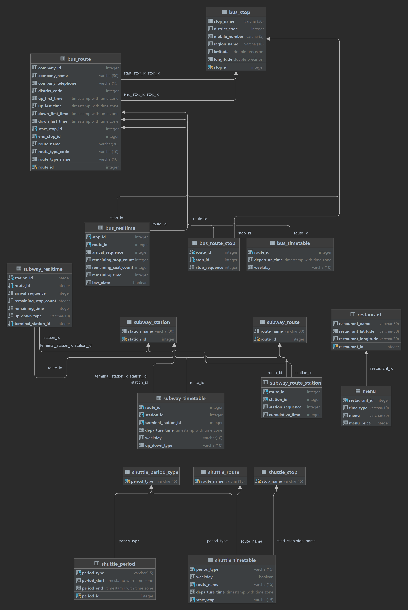

# HYUabot Database
- Database schema to operate HYUabot service.

## Database environment
- This database is operated on postgresql 15.0.

## Database schema
- The database schema is as follows.

## Redesign migration checks

Run `python3 -m unittest discover -s database/tests -v` from the repository root to check that the redesign migration uses repeat-safe DDL and that its added tables, columns, and indexes match `database/create_database.sql`. These checks compare the SQL definitions statically; they do not apply the migration to a PostgreSQL server.
