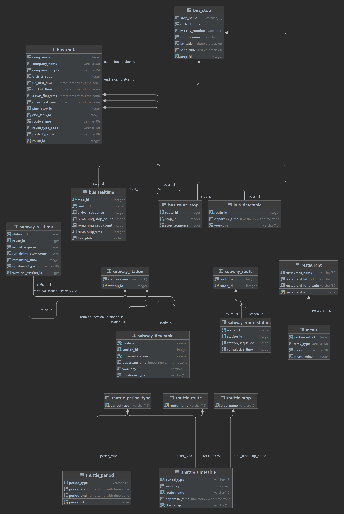

# HYUabot Infrastructure

Kubernetes-based infrastructure for HYUabot — a campus information service for Hanyang University (ERICA). This repository contains Kubernetes manifests, a database schema, and Git submodules for all data-loading containers.

## Repositories

| Repository                                                                                                   | Description                                              | Code Check                                                                                                                                                                                                                              | Deploy                                                                                                                                                                                                                                        |
|--------------------------------------------------------------------------------------------------------------|----------------------------------------------------------|-----------------------------------------------------------------------------------------------------------------------------------------------------------------------------------------------------------------------------------------|-----------------------------------------------------------------------------------------------------------------------------------------------------------------------------------------------------------------------------------------------|
| [hyuabot-backend-kotlin](https://github.com/hyuabot-developers/hyuabot-backend-kotlin)                       | GraphQL API backend (Spring Boot / Kotlin)               | [](https://github.com/hyuabot-developers/hyuabot-backend-kotlin/actions/workflows/code-check.yml)                   | [](https://github.com/hyuabot-developers/hyuabot-backend-kotlin/actions/workflows/deploy.yml)                                   |
| [hyuabot-database-initializer](https://github.com/hyuabot-developers/hyuabot-database-initializer)           | One-time database seeder (Python)                        | [](https://github.com/hyuabot-developers/hyuabot-database-initializer/actions/workflows/code-check.yml)           | [](https://github.com/hyuabot-developers/hyuabot-database-initializer/actions/workflows/deploy.yml)                       |
| [hyuabot-building-updater](https://github.com/hyuabot-developers/hyuabot-building-updater)                   | Campus building & room data loader (Python)              | [](https://github.com/hyuabot-developers/hyuabot-building-updater/actions/workflows/code-check.yml)                   | [](https://github.com/hyuabot-developers/hyuabot-building-updater/actions/workflows/deploy.yml)                               |
| [hyuabot-bus-realtime-updater](https://github.com/hyuabot-developers/hyuabot-bus-realtime-updater)           | Real-time bus arrival updater (Python, every minute)     | [](https://github.com/hyuabot-developers/hyuabot-bus-realtime-updater/actions/workflows/code-check.yml)           | [](https://github.com/hyuabot-developers/hyuabot-bus-realtime-updater/actions/workflows/deploy.yml)                       |
| [hyuabot-bus-timetable-updater](https://github.com/hyuabot-developers/hyuabot-bus-timetable-updater)         | Bus schedule data loader (Python)                        | [](https://github.com/hyuabot-developers/hyuabot-bus-timetable-updater/actions/workflows/code-check.yml)         | [](https://github.com/hyuabot-developers/hyuabot-bus-timetable-updater/actions/workflows/deploy.yml) |
| [hyuabot-bus-log-updater](https://github.com/hyuabot-developers/hyuabot-bus-log-updater)                     | Historical bus departure log recorder (Python, daily)    | [](https://github.com/hyuabot-developers/hyuabot-bus-log-updater/actions/workflows/code-check.yml)                     | [](https://github.com/hyuabot-developers/hyuabot-bus-log-updater/actions/workflows/deploy.yml)                                 |
| [hyuabot-subway-realtime-updater](https://github.com/hyuabot-developers/hyuabot-subway-realtime-updater)     | Real-time subway arrival updater (Python, every minute)  | [](https://github.com/hyuabot-developers/hyuabot-subway-realtime-updater/actions/workflows/code-check.yml)     | [](https://github.com/hyuabot-developers/hyuabot-subway-realtime-updater/actions/workflows/deploy.yml)                 |
| [hyuabot-subway-timetable-updater](https://github.com/hyuabot-developers/hyuabot-subway-timetable-updater)   | Subway schedule data loader (Python)                     | [](https://github.com/hyuabot-developers/hyuabot-subway-timetable-updater/actions/workflows/code-check.yml)   | [](https://github.com/hyuabot-developers/hyuabot-subway-timetable-updater/actions/workflows/deploy.yml)               |
| [hyuabot-shuttle-timetable-updater](https://github.com/hyuabot-developers/hyuabot-shuttle-timetable-updater) | Campus shuttle timetable loader (Python)                 | [](https://github.com/hyuabot-developers/hyuabot-shuttle-timetable-updater/actions/workflows/code-check.yml) | [](https://github.com/hyuabot-developers/hyuabot-shuttle-timetable-updater/actions/workflows/deploy.yml)             |
| [hyuabot-holiday-updater](https://github.com/hyuabot-developers/hyuabot-holiday-updater)                     | Korean public holiday synchronizer (Python, daily)       | [](https://github.com/hyuabot-developers/hyuabot-holiday-updater/actions/workflows/code-check.yml)                     | [](https://github.com/hyuabot-developers/hyuabot-holiday-updater/actions/workflows/deploy.yml)                             |
| [hyuabot-library-updater](https://github.com/hyuabot-developers/hyuabot-library-updater)                     | Reading room availability updater (Python, every minute) | [](https://github.com/hyuabot-developers/hyuabot-library-updater/actions/workflows/code-check.yml)                     | [](https://github.com/hyuabot-developers/hyuabot-library-updater/actions/workflows/deploy.yml)                                 |
| [hyuabot-cafeteria-updater](https://github.com/hyuabot-developers/hyuabot-cafeteria-updater)                 | Dining hall menu updater (Python, hourly)                | [](https://github.com/hyuabot-developers/hyuabot-cafeteria-updater/actions/workflows/code-check.yml)                 | [](https://github.com/hyuabot-developers/hyuabot-cafeteria-updater/actions/workflows/deploy.yml)                             |
| [hyuabot-weather-updater](https://github.com/hyuabot-developers/hyuabot-weather-updater)                     | KMA weather forecast updater (Python, hourly)            | [](https://github.com/hyuabot-developers/hyuabot-weather-updater/actions/workflows/code-check.yml)                     | [](https://github.com/hyuabot-developers/hyuabot-weather-updater/actions/workflows/deploy.yml)                                 |

## Architecture

```
┌───────────────────────────────────────────────────────────┐
│                  Kubernetes Cluster (hyuabot ns)          │
│                                                           │
│  ┌──────────────────┐     ┌──────────────────────────┐    │
│  │  hyuabot-backend │────▶│  hyuabot-database        │    │
│  │  -kotlin:8080    │     │  (PostgreSQL 17, :5432)  │    │
│  │  (GraphQL API)   │     └──────────────────────────┘    │
│  └──────────────────┘                  ▲                  │
│                                        │                  │
│  ┌─────────────────────────────────────┤               │  │
│  │  CronJobs (data updaters)           │               │  │
│  │                                     │               │  │
│  │  Every minute:                      │               │  │
│  │    bus-realtime-updater ────────────┤               │  │
│  │    subway-realtime-updater ─────────┤               │  │
│  │    library-updater ─────────────────┤               │  │
│  │                                     │               │  │
│  │  Hourly:                            │               │  │
│  │    cafeteria-updater (at :00) ──────┤               │  │
│  │    weather-updater (at :20) ────────┘               │  │
│  │                                                     │  │
│  │  Daily:                                             │  │
│  │    bus-log-updater (01:00)                          │  │
│  │    holiday-updater (03:10)                          │  │
│  └─────────────────────────────────────────────────────┘  │
│                                                           │
│  ┌──────────────────────────────────────────────────┐     │
│  │  One-time Jobs (run at initial deployment)       │     │
│  │    database-initializer → building-updater       │     │
│  │    bus-timetable-updater → subway-timetable      │     │
│  │    shuttle-timetable-updater                     │     │
│  └──────────────────────────────────────────────────┘     │
│                                                           │
│  ┌──────────────────┐                                     │
│  │  hyuabot-redis   │  (in-memory cache, :6379)           │
│  └──────────────────┘                                     │
└───────────────────────────────────────────────────────────┘
```

## Kubernetes Manifests

Manifests are applied in numbered order:

| File                           | Resource             | Description                                     |
|--------------------------------|----------------------|-------------------------------------------------|
| `k8s/1.namespace.yaml`         | Namespace            | Creates the `hyuabot` namespace                 |
| `k8s/2.secret.example.yaml`    | Secret template      | API keys, DB credentials                        |
| `k8s/3.database.yaml`          | Deployment + Service | PostgreSQL 17 and Redis                         |
| `k8s/4.initial-loader.yml`     | Job                  | Runs `database-initializer` once                |
| `k8s/5.one-time-loader.yaml`   | Jobs                 | Loads building, bus, subway, shuttle timetables |
| `k8s/6.multi-time-loader.yaml` | CronJobs             | Recurring realtime and periodic updaters        |
| `k8s/7.api.yaml`               | Deployment + Service | Kotlin GraphQL backend                          |
| `k8s/8.kakao.yaml`             | Deployment + Service | Kakao chatbot backend (Go)                      |
| `k8s/9.monitoring.yaml`        | Prometheus + Grafana | Metrics dashboards and operational alerts      |
| `k8s/10.cronjob-monitoring.yaml` | Monitoring metrics | CronJob and Kubernetes state metrics            |
| `k8s/11.metrics-server.yaml`   | Metrics API          | Cross-region K3s resource metrics               |

### Applying the stack

```bash
kubectl apply -f k8s/1.namespace.yaml

# Create the local Secret manifest and replace every placeholder value
cp k8s/2.secret.example.yaml k8s/2.secret.yaml
kubectl apply -f k8s/2.secret.yaml

# Create or update the SQL ConfigMap mounted by the migration job
kubectl create configmap create-database \
  --namespace hyuabot \
  --from-file=database/create_database.sql \
  --dry-run=client -o yaml | kubectl apply -f -

kubectl apply -f k8s/3.database.yaml

# Wait for the schema migration to finish before running the data loaders
kubectl wait --namespace hyuabot \
  --for=condition=complete job/migration-database \
  --timeout=300s

kubectl apply -f k8s/4.initial-loader.yml
kubectl apply -f k8s/5.one-time-loader.yaml
kubectl apply -f k8s/6.multi-time-loader.yaml
kubectl apply -f k8s/7.api.yaml
kubectl apply -f k8s/8.kakao.yaml
kubectl apply -f k8s/9.monitoring.yaml
kubectl apply -f k8s/10.cronjob-monitoring.yaml
```

Before deploying the holiday updater or the backend holiday audit, apply
`database/migrations/20260717_holiday_automation.sql` to the existing database.
The migration aborts without deleting rows when duplicate shuttle decisions exist;
resolve any reported `(holiday_date, calendar_type)` duplicates and rerun it.

### Cross-region metrics-server

K3s's packaged metrics-server prefers one node address type for every node. In this cross-region cluster, the control-plane node is reachable through its private address while the worker kubelet is reachable through its public address. The custom metrics-server maps each node hostname to the address reachable from `personal-project-vm`.

Disable the packaged component in `/etc/rancher/k3s/config.yaml` before deploying the custom manifest:

```yaml
disable:
  - servicelb
  - traefik
  - metrics-server
```

Copy `k8s/11.metrics-server.yaml` to `/var/lib/rancher/k3s/server/manifests/hyuabot-metrics-server.yaml`, then restart K3s. K3s automatically deploys files in that directory.

```bash
sudo install -m 0600 \
  k8s/11.metrics-server.yaml \
  /var/lib/rancher/k3s/server/manifests/hyuabot-metrics-server.yaml
sudo systemctl restart k3s
sudo k3s kubectl rollout status \
  --namespace kube-system \
  deployment/metrics-server \
  --timeout=180s
sudo k3s kubectl top nodes
```

The custom Deployment is pinned to `personal-project-vm`. If a node name or address changes, update `nodeSelector` and `hostAliases` before restarting K3s.

### Required secrets (`k8s/2.secret.example.yaml`)

Copy the example to `k8s/2.secret.yaml`, replace every placeholder, and keep the resulting file local. The actual Secret manifest is ignored by Git.

| Key                         | Used by                                                   |
|-----------------------------|-----------------------------------------------------------|
| `DB_ID`                     | All database-connected containers                         |
| `DB_PASSWORD`               | All database-connected containers                         |
| `BUS_API_KEY`               | bus-timetable-updater, bus-log-updater, holiday-updater   |
| `METRO_API_KEY`             | subway-realtime-updater                                   |
| `WEATHER_API_KEY`           | weather-updater                                           |
| `GOOGLE_PROJECT_ID`         | library-updater (Firebase FCM)                            |
| `GRAFANA_ADMIN_PASSWORD`    | Grafana administrator                                     |
| `GRAFANA_SMTP_FROM_ADDRESS` | Grafana alert email sender                                |
| `GRAFANA_SMTP_PASSWORD`     | Grafana SMTP authentication                               |
| `APNS_TEAM_ID`              | backend Live Activity APNs push                           |
| `APNS_KEY_ID`               | backend Live Activity APNs push                           |
| `APNS_PRIVATE_KEY`          | backend Live Activity APNs push                           |
| `NOTIFIER_SERVICE_TOKEN`    | backend-to-notifier authentication                        |
| `NOTIFIER_GRAFANA_TOKEN`    | Grafana webhook authentication                            |

The two notifier tokens must match the values configured on the separate notifier host. Generate independent, random values for each token and do not commit their decoded values.

### Operations notifier

Operational Web Push is delivered by the private `hyuabot-ops-notifier` service on the separate Oracle Instance-2 runner. Before applying the backend and Grafana manifests:

1. Point `notifier.hyuabot.app` to Oracle Instance-2 and allow inbound HTTPS.
2. Configure the existing reverse proxy to forward HTTPS traffic to the notifier's port; the notifier deployment workflow installs its systemd unit automatically.
3. Configure its VAPID keys, `SERVICE_TOKEN`, and `GRAFANA_TOKEN`; the two tokens must match this cluster's Kubernetes Secret.
4. Verify `https://notifier.hyuabot.app/health`, then apply `k8s/7.api.yaml` and `k8s/9.monitoring.yaml`.

This feature has no PostgreSQL schema or data migration.

### Persistent storage

PostgreSQL data is persisted to `/mnt/data/postgres-pv-volume` on `personal-project-vm` (5 GiB PersistentVolume). The PersistentVolume node affinity and database Deployment node selector keep the host-local data on that node when workers join the cluster.

On an existing cluster, `PersistentVolume.spec.nodeAffinity` cannot be added with a normal `kubectl apply`. Scale the database down and recreate only the retained PV/PVC objects before applying this manifest. The host directory must not be deleted.

The two Kotlin backend replicas use a preferred hostname topology spread constraint, so they are distributed across available nodes without becoming unschedulable when only one node is available.

## Services & Ports

| Service                          | Internal Port | NodePort | Notes          |
|----------------------------------|---------------|----------|----------------|
| `hyuabot-database`               | 5432          | 30432    | PostgreSQL     |
| `hyuabot-redis`                  | 6379          | 30379    | Redis          |
| `hyuabot-backend-kotlin-service` | 8080          | 30001    | NodePort; behind Nginx Proxy Manager |
| Kakao backend                    | 38001         | 30002    | NodePort       |
| `prometheus`                     | 9090          | —        | ClusterIP; scrapes backend `/actuator/prometheus` |
| `grafana`                        | 3000          | 30300    | NodePort; behind host Nginx at `grafana.hyuabot.app` |

## CronJob Schedule Summary

| CronJob                      | Schedule                     | Container image                   |
|------------------------------|------------------------------|-----------------------------------|
| `bus-realtime-cron-job`      | `* * * * *` (every minute)   | `hyuabot-bus-realtime-updater`    |
| `subway-realtime-cron-job`   | `* * * * *` (every minute)   | `hyuabot-subway-realtime-updater` |
| `reading-room-cron-job`      | `* * * * *` (every minute)   | `hyuabot-library-updater`         |
| `cafeteria-cron-job`         | `0 * * * *` (every hour)     | `hyuabot-cafeteria-updater`       |
| `weather-cron-job`           | `20 * * * *` (hourly at :20) | `hyuabot-weather-updater`         |
| `bus-departure-log-cron-job` | `0 1 * * *` (daily 01:00)    | `hyuabot-bus-log-updater`         |
| `holiday-cron-job`          | `10 3 * * *` (daily 03:10 KST) | `hyuabot-holiday-updater`       |

## Container Registry

All images are pulled from a local private registry at `localhost:5000`. Each repository's `deploy.yml` workflow builds a multi-stage Alpine Docker image and pushes it to this registry on every merged PR.

Build runners: X64 Linux (code checks) · ARM64 Linux (Docker builds).

## Database

The `database/` directory contains the canonical PostgreSQL schema.



### Schema overview

| Domain          | Tables                                                                                    |
|-----------------|-------------------------------------------------------------------------------------------|
| Auth            | `admin_user`, `admin_user_invitation`, `auth_refresh_token`                               |
| Bus             | `bus_route`, `bus_stop`, `bus_timetable`, `bus_realtime`, `bus_departure_log`             |
| Subway          | `subway_route`, `subway_station`, `subway_timetable`, `subway_realtime`                   |
| Shuttle         | `shuttle_route`, `shuttle_stop`, `shuttle_timetable`, `shuttle_period`, `shuttle_holiday` |
| Holiday         | `public_holiday`, `holiday_sync_state`                                                   |
| Commute Shuttle | `commute_shuttle_route`, `commute_shuttle_stop`, `commute_shuttle_timetable`              |
| Campus          | `building`, `room`, `campus`                                                              |
| Campus Services | `menu`, `restaurant`, `reading_room`                                                      |
| Notices & Info  | `notices`, `phonebook`, `academic_calendar`                                               |

## Git Submodules

The data-loader containers are included as Git submodules under `containers/`:

```
containers/
├── database        → hyuabot-database-initializer
├── bus/
│   ├── realtime    → hyuabot-bus-realtime-updater
│   └── timetable   → hyuabot-bus-timetable-updater
├── subway/
│   ├── realtime    → hyuabot-subway-realtime-updater
│   └── timetable   → hyuabot-subway-timetable-updater
├── library         → hyuabot-library-updater
├── cafeteria       → hyuabot-cafeteria-updater
└── shuttle         → hyuabot-shuttle-timetable-updater
```

Clone with submodules:

```bash
git clone --recurse-submodules https://github.com/hyuabot-developers/hyuabot-infrastructure
```

## Repository Details

### hyuabot-backend-kotlin

Spring Boot 4 / Kotlin 2 GraphQL API. Serves all campus data to mobile clients via Spring GraphQL + Netflix DGS. Uses PostgreSQL (JPA/Hibernate 7) for persistence and Redis (Lettuce) for caching. Security is handled with Spring Security + JJWT. Requires Java 21.

**CI:** ktlint (style) + JUnit + JaCoCo (≥40% overall coverage). **Deploy:** Docker multi-stage build pushed to local registry, followed by `kubectl rollout restart`.

---

### hyuabot-database-initializer

Python 3.12 one-time seeder. Uses SQLAlchemy + aiohttp to fetch and insert initial data for shuttle routes, city buses, subway lines, campus buildings, restaurants, phonebook entries, and the academic calendar.

**CI:** flake8 + mypy + pytest against a live PostgreSQL service. **Deploy:** Docker image pushed on merged PR.

---

### hyuabot-building-updater

Python one-time job. Scrapes Hanyang University's portal with BeautifulSoup4/lxml to populate `building` and `room` tables.

**CI:** flake8 + mypy + pytest. **Deploy:** ARM64 Docker build on merged PR.

---

### hyuabot-bus-realtime-updater

Python CronJob that runs every minute. Deletes stale arrival records then fetches fresh real-time bus positions via the public bus API and writes them to `bus_realtime`.

**CI:** flake8 + mypy + pytest. **Deploy:** ARM64 Docker build on merged PR.

---

### hyuabot-bus-timetable-updater

Python one-time job. Calls the public bus timetable API for all relevant routes and populates `bus_timetable`. Excludes routes 62, 9090, 110, and 707.

**CI:** flake8 + mypy + pytest. **Deploy:** ARM64 Docker build on merged PR.

---

### hyuabot-bus-log-updater

Python CronJob that runs daily at 01:00. Fetches historical bus departure data for a configurable number of past days (`DAYS_PAST` env var) and writes records to `bus_departure_log`.

**CI:** flake8 + mypy + pytest. **Deploy:** ARM64 Docker build on merged PR.

---

### hyuabot-subway-realtime-updater

Python CronJob that runs every minute. Queries the Seoul Metro open API for real-time arrival information on Line 4 (1004) and the Suin-Bundang Line (1071) and updates `subway_realtime`. Supports master-DB failover.

**CI:** flake8 + mypy + pytest. **Deploy:** ARM64 Docker build on merged PR.

---

### hyuabot-subway-timetable-updater

Python one-time job. Fetches full timetable data for Line 4 and Suin-Bundang Line and populates `subway_timetable`. Supports master-DB failover.

**CI:** flake8 + mypy + pytest. **Deploy:** ARM64 Docker build on merged PR.

---

### hyuabot-shuttle-timetable-updater

Python one-time job. Loads shuttle route definitions, route stops, and full timetables into the `shuttle_*` tables. Supports master-DB failover.

**CI:** flake8 + mypy + pytest. **Deploy:** ARM64 Docker build on merged PR.

---

### hyuabot-library-updater

Python CronJob that runs every minute. Scrapes real-time reading room seat availability from Hanyang University library branches and updates `reading_room`. Sends push notifications via Firebase Cloud Messaging (FCM) using a Google service account.

**CI:** flake8 + mypy + pytest (with `GOOGLE_APPLICATION_CREDENTIALS` secret). **Deploy:** ARM64 Docker build on merged PR (service account JSON is copied into the image).

---

### hyuabot-cafeteria-updater

Python CronJob that runs every hour. Scrapes the university dining portal for daily menus and writes them to `menu`/`restaurant`. Deadline: 10 minutes per run.

**CI:** flake8 + mypy + pytest. **Deploy:** ARM64 Docker build on merged PR.

---

### hyuabot-weather-updater

Python CronJob that runs every hour at :20. Fetches current weather observations from the Korea Meteorological Administration (KMA) open API and upserts bilingual (Korean/English) weather notices. Deadline: 2 minutes per run, up to 10 retries.

**CI:** flake8 + mypy. **Deploy:** ARM64 Docker build on merged PR.
